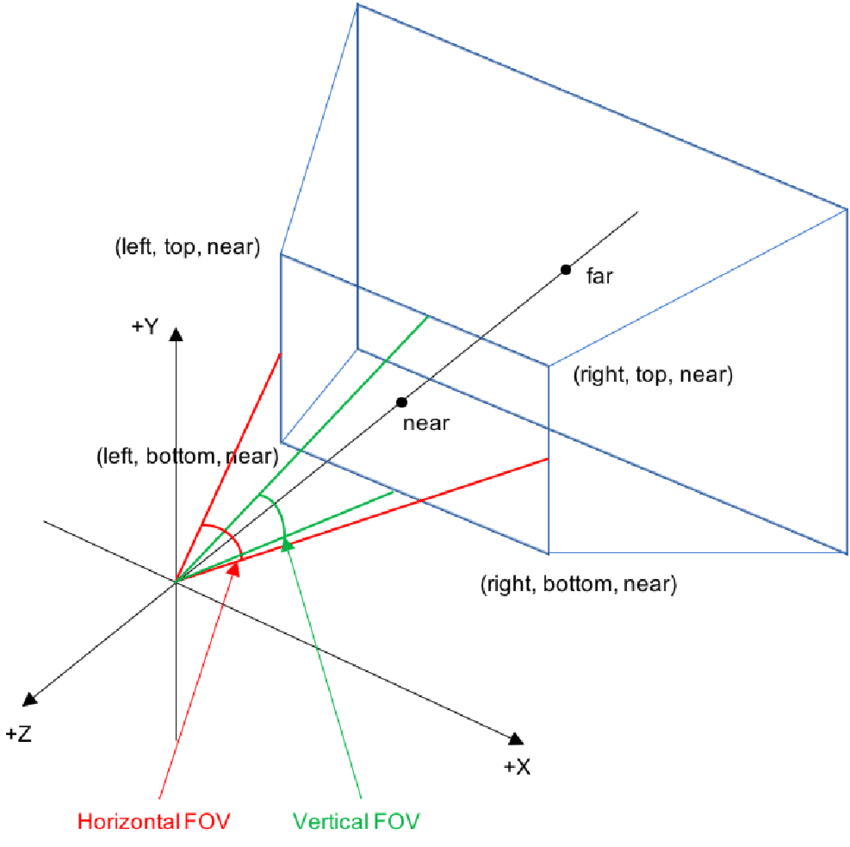
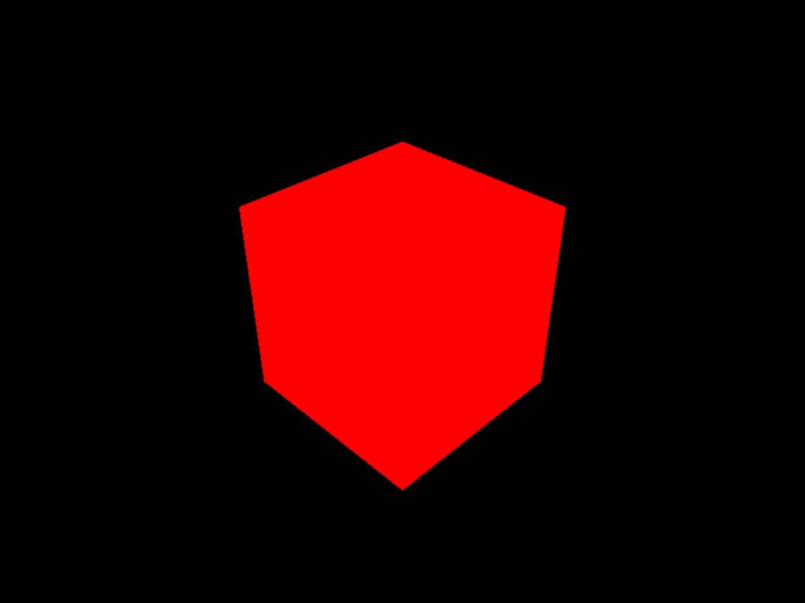
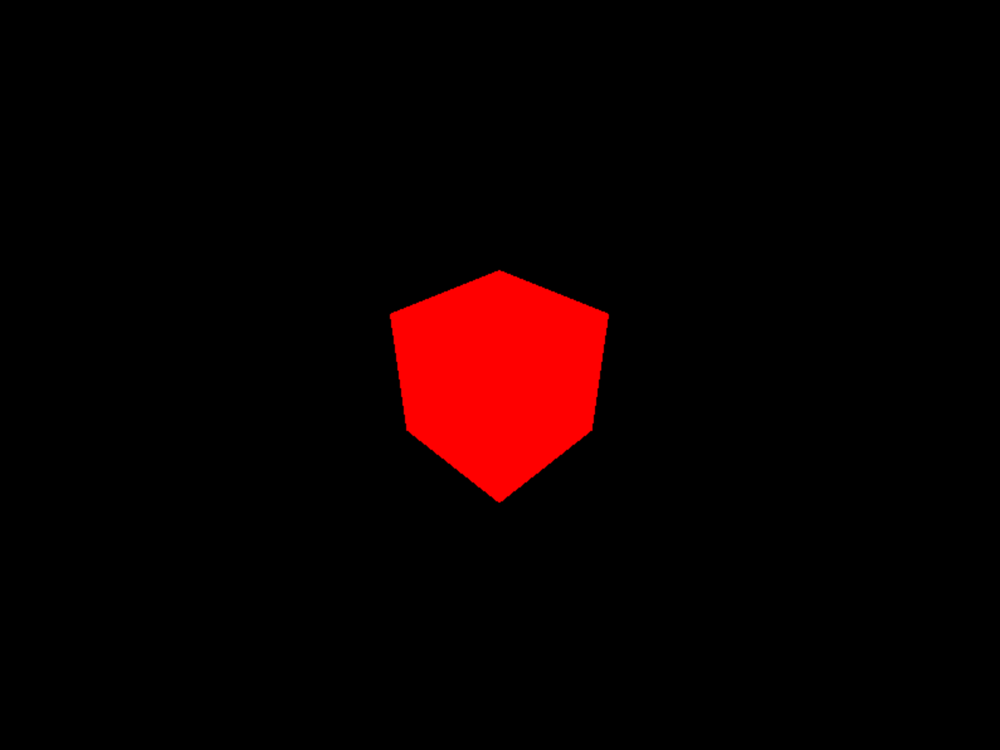
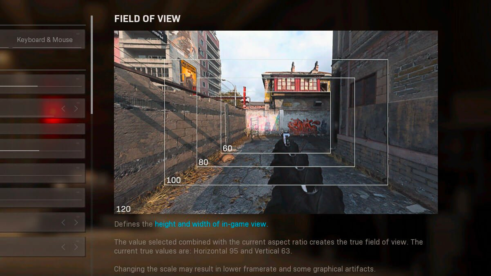
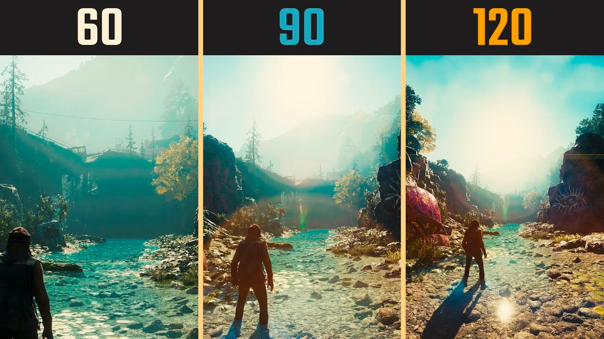
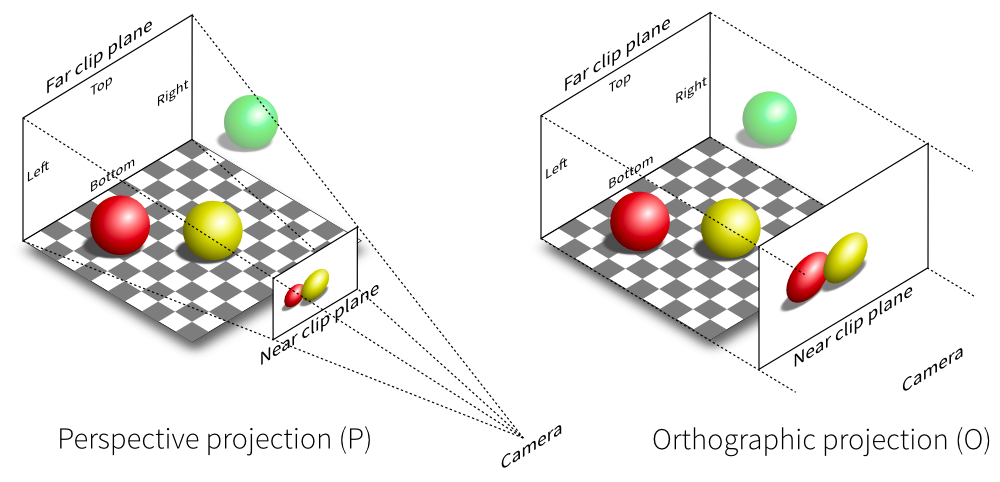
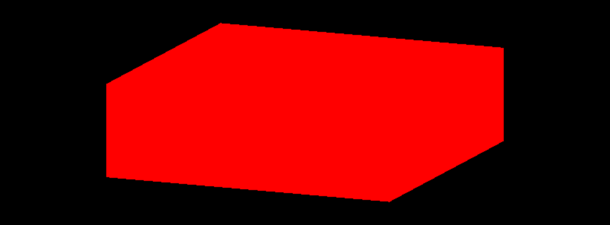
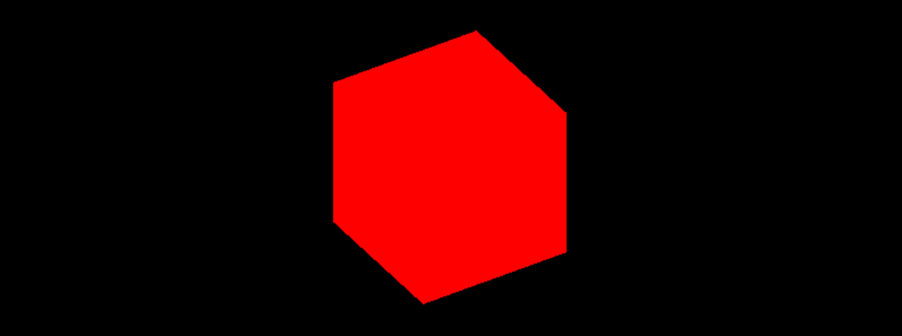

# 1. Introduction

[three.js 공식 문서](https://threejs.org/docs/#api/en/cameras/Camera)에 다양한 카메라 docs 가 있다.
- ArrayCamera
- Camera
- CubeCamera
- OrthographicCamera
- PerspectiveCamera
- StereoCamera

모든 것을 설명하지만 2개만 사용할 것이다.

## Camera 종류
### Camera
- 추상적인 카메라로, 다른 카메라들을 상속하고 있다.
- **abstract class**로 direct 로 사용하지 않는다.

### ArrayCamera

- 멀티 유저 게임과 같이 한 스크린에 여러 시각에서의 화면이 필요할 때 사용
- (사용 안 할 예정)

### StereoCamera

- 두 개의 카메라로 화면을 렌더링하는 것
- 마치 두 개의 눈으로 시각 정보를 처리하는 것과 유사하다.
- VR 등에 사용
- (사용 안 할 예정)

### CubeCamera

- 6개의 render를 가지고 있다.
- 주변부, 반사, 그림자 등을 생성할 때 주로 사용한다.
- (지금은 사용 안 하고 나중에 사용할 예정)

### ⭐️ OrthographicCamera

- 원근감이 없는 카메라
- 물체의 거리에 따라 크기가 달라지는 것이 없다.

### ⭐️ PerspectiveCamera

- 원근감이 있는 카메라

# 2. Perspective Camera

> 💡 **PerspectiveCamera( fov : Number, aspect : Number, near : Number, far : Number )**


```jsx
const camera = new THREE.PerspectiveCamera(75, sizes.width / sizes.height, 1, 100)
```
모든 params를 다 쓰지는 않아도 된다(near, far은 안 써도 됨)

## Parameters

### fov: field of view

- 각도
    - **vertical vision** (not horizontal!)

      

    - 수직적인 각도를 의미하므로,
        - 각도가 작을수록 더 좁은 범위가 보임 → zoom in 효과
        - 각도가 클수록 더 넓은 범위가 보임 → zoom out 효과
        - 예시
            - fov = 45

          

            - fov = 75

          

          

          

- 보통 프로젝트 시작할 때 지정하고 잘 바꾸지 않음
    - 바꾸게 되면 보이던 object 들이 안 보일 수 있기 때문에
    - performance 에도 문제가 생길 수 있음
- default: 50

### aspect: Aspect Ratio

- 가로세로 비율
- 보통은 가로를 세로로 나눈 값을 사용한다.

```jsx
const aspect = width / height;
```

- default: 1

### near & far

- 카메라가 어느 정도 범위를 찍을 것인지 지정
- near 보다 짧은 거리와 far 보다 먼 거리의 물체는 카메라에 보이지 않는다.

#### z-fighting

- 만약 near = 0.00001, far = 9999999 와 같이 너무 큰 숫자를 넣게되면 아주 가까이 있는 두 물체 사이에 어떤 부분을 더 앞에 렌더링 해야 하는지 차이를 알 수 없어서 z-fighting 이라는 문제가 생기게 된다.
- 적절한 거리를 설정하고 object 가 보이지 않을 때만 숫자를 조정하는 것이 좋다.
    - near = 0.1, far = 100(~200)이 적절하다.
- **카메라에 근접할 수록 z-depth값에 대한 가중치가 높아지기 때문에 주로 near plane 값을 카메라로부터 멀리 조절하면 된다.**

[https://m.blog.naver.com/PostView.naver?isHttpsRedirect=true&blogId=softcool&logNo=110025105010](https://m.blog.naver.com/PostView.naver?isHttpsRedirect=true&blogId=softcool&logNo=110025105010)

[https://sanghoon23.tistory.com/m/79](https://sanghoon23.tistory.com/m/79)

- default: near-0.1, far-2000

# 3. Orthographic Camera


> 💡 **OrthographicCamera( left : Number, right : Number, top : Number, bottom : Number, near : Number, far : Number )**


```jsx
const camera = new THREE.OrthographicCamera( width / - 2, width / 2, height / 2, height / - 2, 1, 1000 );
```

- Perspective Camera에서 원근감을 제외한 카메라
- 아주 멀리서 관찰하는 것같은 모습을 보인다.



## Parameters

### left & right & top & bottom

- 각각의 길이만큼의 사각형을 만들고 그 모양대로 수평적으로 캡쳐하는 것처럼 보인다.
- 캡쳐 후에 render되는 screen의 크기에 맞게 늘리기 때문에 종횡비가 맞지 않게 캡쳐한 경우에는 렌더링 시 찌그러진 모양이 나올 수 있다.
    - 문제 상황

      

    - 해결방법

      aspect ratio를 각 가로 길이에 곱해주면 비율에 맞게 렌더링이 된다.

        ```jsx
        const aspect = sizes.width / sizes.height;
        const camera = new THREE.OrthographicCamera(-1 * aspect, 1 * aspect, 1, -1);
        ```

      


# 4. Custom Controls

## 마우스를 움직여서 시점 바꾸기

### cursor condination

- 자바스크립트로 window에 `mousemove` 이벤트 감지하기

```jsx
/**
 * Cursor
 */
window.addEventListener('mousemove', (event) => {
    console.log('x: ', event.clientX);
    console.log('y: ', event.clientY);
})
```

- -1~1사이로 mapping 하기
    1. viewport의 값으로 나눠주기 → 0~1 mapping
    2. 0.5 빼기 → -0.5 to 0.5 mapping
    3. 2 곱하기 → -1 to 1 mapping

```jsx
cursor = {
	x; 0
	y: 0
}

window.addEventListener('mousemove', (event) => {
    cursor.x = (event.clientX / sizes.width - 0.5) * 2;
    cursor.y = (event.clientY / sizes.height - 0.5) * 2;
})
```

### 카메라 위치 이동

```jsx
const tick = () => {
    ...

    // Update camera
    camera.position.x = cursor.x;
    camera.position.y = cursor.y;

		...
}
```

- three.js 에서는 Y 축이 위가 1, 아래가 -1인데 window.mousemove 기준으로는 아래로 내려갈수록 크기가 커지기 때문에 Y축은 reverse로 매핑해주어야 함.

    ```jsx
    window.addEventListener('mousemove', (event) => {
        cursor.x = (event.clientX / sizes.width - 0.5) * 2;
        cursor.y = -(event.clientY / sizes.height - 0.5) * 2;
    })
    ```


### 카메라 시점 이동

- 카메라가 이동하면서 항상 (0, 0, 0)을 볼 수 있도록 `camera.lookAt()` 을 사용하여 카메라의 시점을 조절한다.
- 참고: THREE.Vector3의 초기값은 x = 0, y = 0, z = 0

```jsx
camera.lookAt(new THREE.Vector3()); // 0, 0, 0 이 초기값임을 이용
camera.lookAt(mesh.position); // 실제 mesh(육면체)의 위치 전달
```

### mesh의 뒤쪽 탐색: 구 형태

- 삼각함수를 이용하여 구현
- **x 축과 z축을 `원주`에 mapping** 해야 한다.
    - 원주 = $2πR$

    ```jsx
    camera.position.x = Math.sin(cursor.x * Math.PI) * 3;
    camera.position.z = Math.cos(cursor.x * Math.PI) * 3;
    camera.position.y = cursor.y * 5;
    ```


# 5. Built-in controls

[three.js](https://threejs.org/docs/?q=contro#examples/en/controls/ArcballControls)

## Control 종류

### **DeviceOrientationControls**

- device의 카메라 위치에 따라 Control 이 달라짐
- 보통 스마트폰의 이동에 따라 많이 사용됨
    - 다만 IOS는 더이상 제공되지 않음.

### **FlyControls**

- 마치 우주선에 있는 것 같은 Control
- 앞 뒤 움직임, zoom, rotate

### **FirstPersonControls**

- FlyControl과 비슷하지만 **up axis 는 고정**된 control

### **PointerLockControls**

- pointer는 잠가진 control
- 시점이 항상 중앙으로 고정되어 있음.
- 앞, 뒤, 양 옆, 점프 → 키보드로 이동
- 마우스로 시점 각도이동 가능

### ⭐️ **OrbitControls**

- 마우스로 이동 및 줌, 시점 이동 가능

### **TrackballControls**

- OrbitControl 과 비슷하지만 전체 구를 다 돌 수 있기 때문에 하늘, 땅 구분이 안 됨
- 뒤집어진 화면을 볼 수 있음

### **TransformControls**

- 카메라는 가만히 있고 축을 기준으로 이동함

### **DragControls**

- 카메라는 가만히 있고 object들을 drag로 움직일 수 있음

# 6. OrbitControls

- 카메라 update는 OrbitControls 에서 하기 때문에 tick function에서 임의로 update 하지 않아도 된다.

## Instanciating

- OrbitControls 는 Three.js 에서 제공해주는 Control 이지만 three 안에 내장되어 있지 않다.

```jsx
import {OrbitControls} from "three/examples/jsm/controls/OrbitControls";
```

- OrbitControls 에 2개의 param 필요
    1. camera : 카메라 시점 이동을 OrbitControl에게 넘김
    2. DOM element: DOM 에 접근해서 마우스 이벤트 받기

```jsx
const controls = new OrbitControls(camera, canvas);

// 만약 시점의 일부를 고정하고 싶은 경우
// 값을 할당한 후에는 update 함수를 꼭 호출해야 함
controls.target.y = 1;
controls.update();
```

## Damping

- 마우스 움직임이 끝나도 부드럽게 이동을 제어하는 효과
- enableDamping을 해도 각 프레임마다 control을 업데이트 해야 하므로 tick에 update 추가

```jsx
const controls = new OrbitControls(camera, canvas);
controls.enableDamping = true;

const tick = () => {
    ...

    // Update controls
    controls.update();

    ...
}
```

## ㅋㅋㅋ 퀴즈

- 퀴즈 1

  두 가지 중요한 카메라가 있었는데

    1. 원근감이 있는 카메라는 무엇일까요?
    2. 원근감이 없는 카메라는 무엇일까요?
- 정답 1
    1. perspective camera
    2. orthographic camera

- 퀴즈 2

  perspective camera에서 z-fighting 이 일어나는 이유는?

- 정답 2

  near = 0.00001, far = 9999999 와 같이 너무 큰 숫자를 넣게되면 아주 가까이 있는 두 물체 사이에 어떤 부분을 더 앞에 렌더링 해야 하는지 차이를 알 수 없어서 z-fighting 이라는 문제가 생기게 된다.


- 퀴즈 3

  orthographic camera 로 캡쳐했을 때 종횡비가 맞지 않는 경우 찌그러진 화면이 나올 수 있다.
  이를 해결하는 방법은?

- 정답 3

  가로에 종횡비(aspect ratio)를 곱해준다.