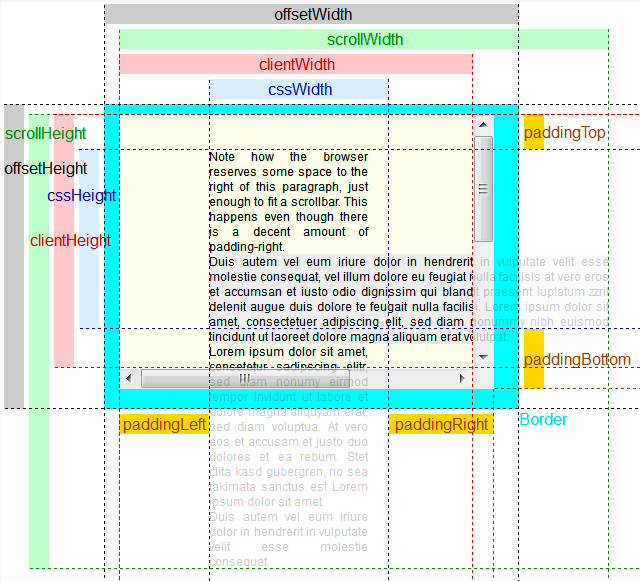
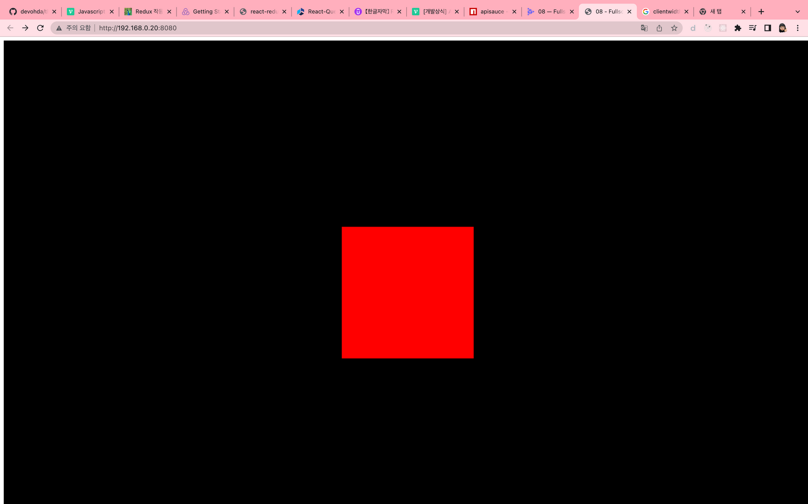
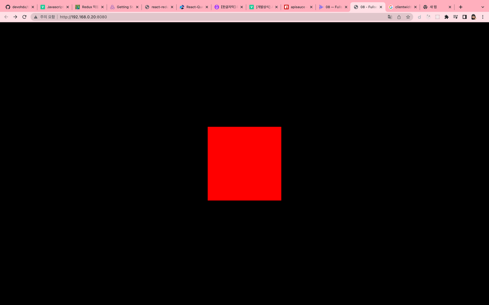
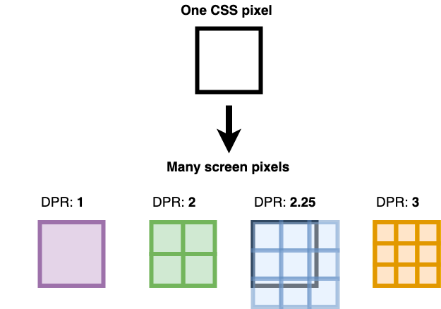
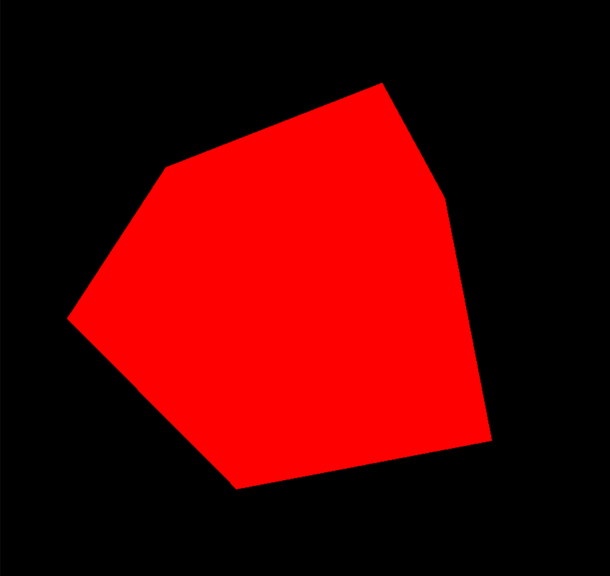
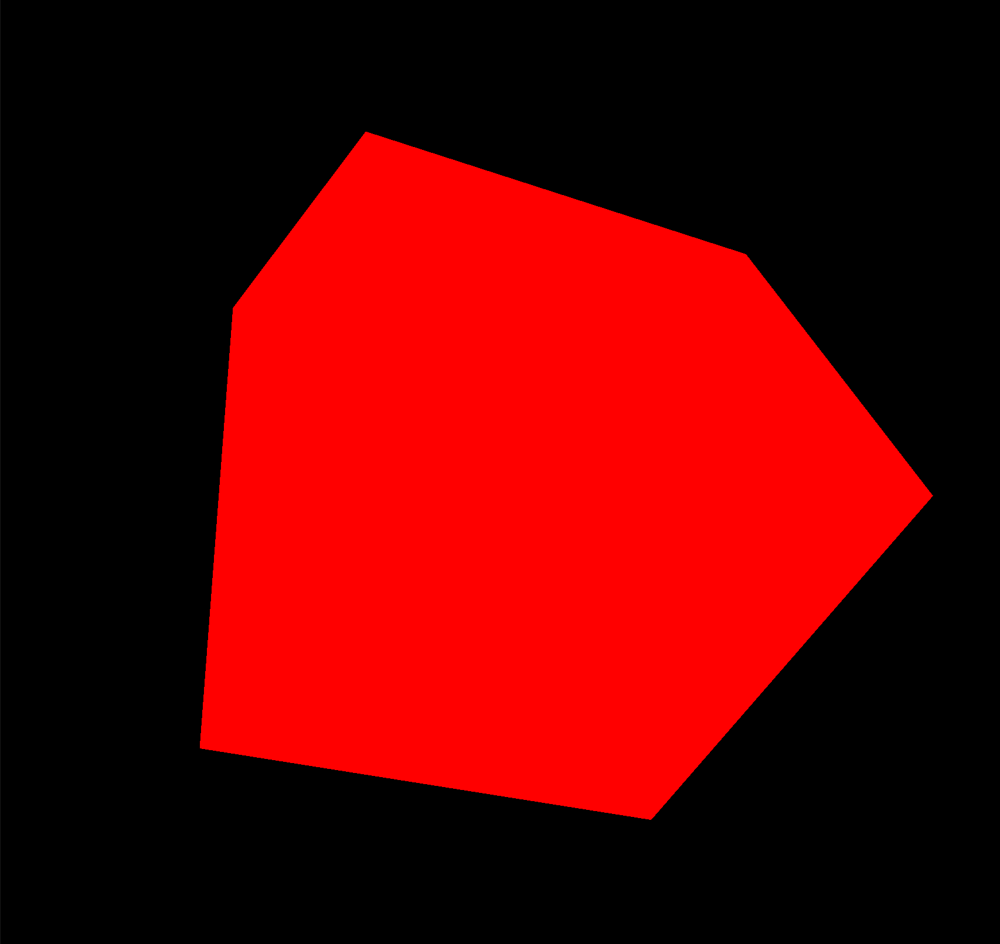

# 1. Introduction

이전 강의에서는 캔버스의 크기를 800*600으로 고정해놓았다.

# 2. Setup

이전 강의에서 OrbitControl 을 사용하여 육면체를 만들었기 때문에 이동 및 zoom 이 가능하다.

# 3. ****Fit in the viewport****

## canvas viewport에 fit 하게 만들기

- screen vs window vs viewport 의 차이
    - screen: 실제 화면의 크기(= 모니터의 크기)
    - window: contents 영역 + 주소창(= chrome 크기)
    - viewport: contents 영역(=chrome 탭 콘텐츠 크기)
    - 참고

      [https://stackoverflow.com/questions/33770549/viewport-vs-window-vs-document](https://stackoverflow.com/questions/33770549/viewport-vs-window-vs-document)

      [https://stackoverflow.com/questions/21064101/understanding-offsetwidth-clientwidth-scrollwidth-and-height-respectively](https://stackoverflow.com/questions/21064101/understanding-offsetwidth-clientwidth-scrollwidth-and-height-respectively)

      


```javascript
/**
 * Sizes
 */
const sizes = {
    width: window.innerWidth, // viewport width
    height: window.innerHeight // viewport height
}
```

## 다양한 문제 해결

### 문제 1

아래와 같이 왼쪽 상단에 흰색 margin 이 생긴다.



### 해결방법 1-1

css 파일에서 margin, padding 을 제거한다. (= reset.css)

```css
* {
    margin: 0;
    padding: 0;
}
```



### 문제 2

전체 화면에 스크롤이 생겼다.

~~나의 컴퓨터에서는 일어나지 않는 현상~~

### 해결방법 2

css 파일에서 canvas의 위치를 fixed 로 조절한다.

```css
.webgl {
    position: fixed;
    top: 0;
    left: 0;
}
```

### 문제 3

blue outline 이 생긴다. (OS나 브라우저의 버전에 따라 안 보일 수도 있다.)

~~나의 컴퓨터에서는 일어나지 않는 현상~~

### 해결방법 3

```css
.webgl {
    ...
		outline: none;
}
```

### 문제 4

전체 화면임에도 불구하고 macOS 의 경우에는 스크롤이 bouncing 되는 효과가 있다.

~~나의 컴퓨터에서는 일어나지 않는 현상~~

### 해결방법 4

```css
html, body {
    overflow: hidden;
}
```

# 4. ****Handle resize****

## resize 했을 때도 screen에 fit 하게 만들기

1. size update 하기
2. camera의 종횡비 update 후 matrix 계산하기
3. renderer의 size 조절하기

```javascript
window.addEventListener('resize', () => {

    // update sizes
    sizes.width = window.innerWidth;
    sizes.height = window.innerHeight;

    // update camera
    camera.aspect = sizes.width / sizes.height;
    camera.updateProjectionMatrix();

    // update renderer
    renderer.setSize(sizes.width, sizes.height);
})
```

# 5. ****Handle pixel ratio****

## pixel ratio

pixel ratio는 물리적으로 모니터가 가진 pixel의 수에 따라 달려있다.

예전에는 pixel ratio 가 1이였으며, 화면을 가까이 보면 pixel 을 확인할 수 있었다. 이후 pixel ratio 2 이상(레티나 디스플레이 등)의 디스플레이가 개발되었다. pixel ratio가 증가하면 하나의 픽셀이 배수로 쪼개져서 render 된다. GPU가 더 많이 계산해서 해상도가 높은 화면이 나오게 된다.

이 때, 해상도가 낮은 이미지가 해상도가 높은 디스플레이에 보여지면 쪼개진 작은 단위의 픽셀들이 같은 색상을 갖게 되면서 blurry 하게 보일 수 있다.

보통 모바일 기기들이 높은 pixel ratio 를 가진다.



## pixel ratio 변경하기

스크린의 pixel ratio를 알기 위해서는 `window.devicePixelRatio` 를 호출하면 된다. (mac pro는 2)

```jsx
renderer.setPixelRatio(window.devicePixelRatio);
```

### 결과

오른쪽 모습처럼 훨씬 가장자리가 선명하게 rendering 된다.





## pixel ratio 제한하기

모바일에서는 pixel ratio 5 정도로 필요 이상의 pixel ratio 값을 사용하기 때문에 제한해줄 필요가 있다.

또한, 해당 캔버스가 다른 디바이스에 옮겨갈 수도 있기 때문에 resize 이벤트 핸들러에도 추가해주어야 한다. 아래의 코드를 처음 선언 시와 resize 이벤트 핸들러에 모두 추가해준다.

```jsx
renderer.setPixelRatio(Math.min(window.devicePixelRatio, 2));
```

# 6. Handle fullscreen

## 더블클릭 시 fullscreen 만들기

```jsx
window.addEventListener('dblclick', () => {
    if(!document.fullscreenElement) {
        canvas.requestFullscreen();
    }else{
        document.exitFullscreen();
    }
})
```

`dblclick` 이벤트 발생 시 fullscreen 여부에 따라 fullscreen을 조절해주면 된다.

다만, **safari** 에서는 `canvas.requestFullscreen` 을 지원하지 않는다.

## safari 지원하는 코드

```jsx
window.addEventListener('dblclick', () => {
    const fullscreenElement = document.fullscreenElement || document.webkitFullscreenElement;

    if(!fullscreenElement) {
        if(canvas.requestFullscreen) {
            canvas.requestFullscreen();
        }else if(canvas.webkitRequestFullscreen) {
            canvas.webkitRequestFullscreen();
        }
    }else{
        if(document.exitFullscreen){
            document.exitFullscreen();
        }else if(document.webkitExitFullscreen){
            document.webkitExitFullscreen();
        }
    }
})
```