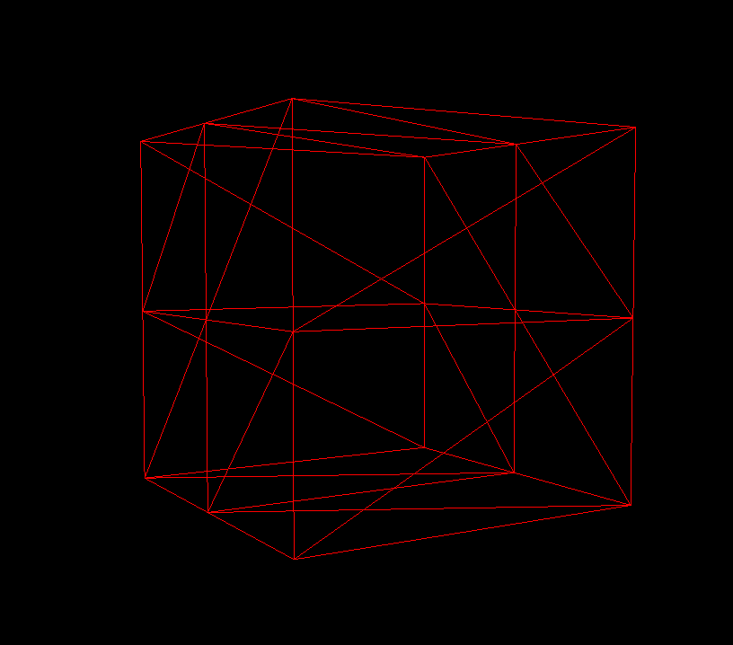
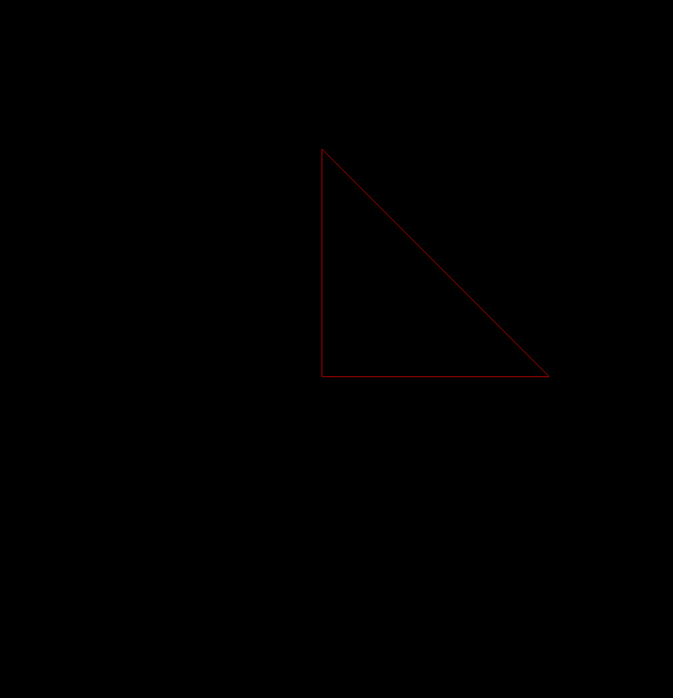

# 1. ****Introduction****

지금까지 사용했던 BoxGeometry 이외에도 다양한 geomatry 를 알아보자.

# 2. ****What is a geometry?****

## 구성요소

- `vertex(vertices)`: coordinate of space (=정점)
- `faces`: 정점을 잇는 삼각형 면

이 구성요소들을 통해 particle 또는 mesh 를 만들 수 있다.

mesh: polygon이 모여서 만들어진 3차원 물체

particle: paricle system 을 이루는 작고 단순한 이미지 또는 mesh (ex. 연기구름) 으로 다양한 값을 포함하고 있다.

# 3. ****The different built-in geometries****

## [BufferGeometry](https://threejs.org/docs/#api/en/core/BufferGeometry)

해당 class 하위에 다양한 geometry 들이 속해있다.

### BoxGeometry

- 정육면체

### PlaneGeometry

- 면(2차원)
- 두 개의 면으로 이루어져있다.

### CircleGeometry

- 원(2차원)

### ConeGeometry

- 다각뿔

### CylinderGeometry

- 다각기둥

### RingGeometry

- 가운데가 뚫려있는 다각형(2차원)

### TorusGeometry

- 도넛모양(3차원)

### TorusKnotGeometry

- 복잡하게 연결된 토러스 매듭(3차원)

### DodecahedronGeometry

- 다각면체(기본 12)

### OctahedronGeometry

- 다각면체(기본 8)

### TetrahedronGemetry

- 다각면체(기본 3)

### **IcosahedronGeometry**

- 다각면체(기본 20)

### SphereGeometry

- 구
- 많이 사용이 된다.

### ShapeGeometry

- 모양이 있는 면(2차원)
- Curve 가 기본 바탕이 된다.

### TubeGeometry

- 튜브모양(3차원)

### ExtrudeGeometry

- 돌출형상(3차원)

### LatheGeometry

- 선반 기하학(3차원)
- 한 면을 만들고 360도 돌린 모양

### TextGeometry

- 글자를 3차원으로 만든 것(3차원)

## 활용

위의 Geometry 들을 이용해서 원하는 모양의 geometry 를 만들어야 한다.

# 4. ****Box example****

<aside>
💡 **BoxGeometry(width : Float, height : Float, depth : Float, widthSegments : Integer, heightSegments : Integer, depthSegments : Integer)**

</aside>

## parameters

- width: size of x axis
- height: size of y axis
- depth: size of z axis
- widthSegments
- heightSegments
- depthSegments

## segment

각 값 당 얼만큼의 triangle이 들어가는지를 의미한다. segment가 증가할 수록 한 축이 더 나뉘어지며 detail 하게 표현할 수 있다.

기본적으로는 plane한 면이지만 wireframe으로 확인하면 얼마나 나뉘었는지 확인할 수 있다.

```jsx
const geometry = new THREE.BoxGeometry(1, 1, 1, 1, 2, 2);
const material = new THREE.MeshBasicMaterial({
  color: 0xff0000,
  wireframe: true,
});
```



# 5. ****Creating your own buffer geometry****

## store buffer geometry data

각각의 geometry data를 저장한 후에 face를 만들게 된다. 이를 위해 `Float32Array` 를 사용한다.

### Float32Array

- float 타입 array: 다른 type은 넣을 수 없다.
- 길이가 고정
- 컴퓨터가 다루기에 쉬운 값

## custom geometry 만들기

### 초기화 방법

1. 선언 후에 초기화

```jsx
// Custom geometry
const positionArray = new Float32Array(9);

positionArray[0] = 0; // first vertex
positionArray[1] = 0;
positionArray[2] = 0;

positionArray[3] = 0; // second vertex
positionArray[4] = 1;
positionArray[5] = 0;

positionArray[6] = 1; // third vertex
positionArray[7] = 1;
positionArray[8] = 1;
```

1. 선언과 동시에 초기화

```jsx
// Custom geometry
const positionArray = new Float32Array([
    0, 0, 0, // first vertex
    0, 1, 0, // second vertex
    1, 0, 0, // third vertex
]);
```

### Attribute 만들기

위에서 만든 array 값이 각 3개당 하나의 점을 나타냄을 알려주어야 한다. (꼭 3개는 아니고 나중에 또 다룰 예정)

```jsx
const positionAttribute = new THREE.BufferAttribute(positionArray, 3);
```

### geometry 만들기

```jsx
const geometry = new THREE.BufferGeometry();
geometry.setAttribute("position", positionAttribute);
```

생성한 attribute로 geometry를 만든다.  shader 가 position 이라는 이름을 읽어서 그리기 때문에 position에 attribute를 추가한다. 위의 array 위치값으로 만들면 삼각형이 나온다.



### random 한 삼각형 만들기

```jsx
// Custom geometry
const geometry = new THREE.BufferGeometry();

const count = 50;
const positionArray = new Float32Array(50 * 3 * 3); // count 개의 삼각형

for (let i = 0; i < count * 3 * 3; i++) {
  positionArray[i] = Math.random() - 0.5;
}

const positionAttribute = new THREE.BufferAttribute(positionArray, 3);
geometry.setAttribute("position", positionAttribute);
```

random 이 0~1 값을 가져오기 때문에 -0.5를 계산하여 그려지는 값들을 원점으로 옮길 수 있다.

# 6. Index

어떤 삼각형은 vertex를 공유한다. 공유하는 부분을 계속 반복하지 않고 줄이기 위해 [index](https://threejs.org/docs/?q=buffer#api/en/core/BufferGeometry.index)를 두면 GPU의 연산량을 줄일 수 있다.