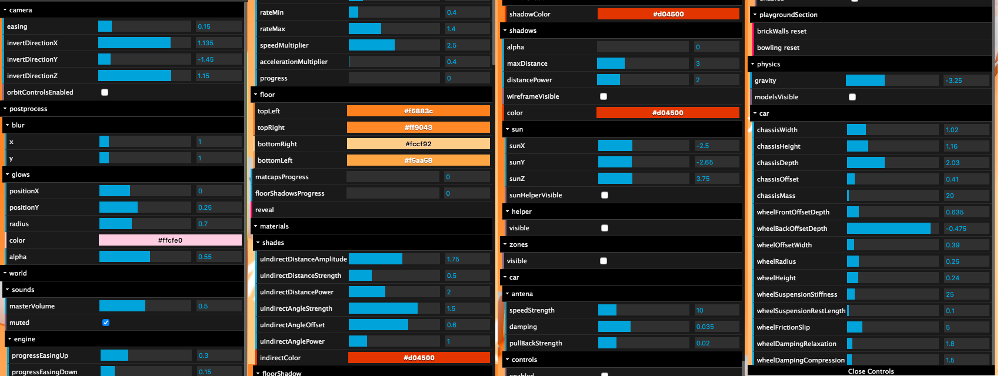

# 1. Introduction

만약 color 를 바꾸고 싶을 때 변경 후 계속 실행시켜서 확인하게 되면 시간이 많이 걸리게 된다. 이를 해결하기 위해서는 `debug UI` 를 사용하는 것이 좋다.

## 라이브러리

라이브러리를 사용하면 쉽게 debug 할 수 있다.

1. dat.GUI
2. control-panel
3. ControlKit
4. Guify
5. Oui

dat.GUI 를 사용할 예정: 가장 유명하기 때문에

# 2. Example

[https://bruno-simon.com/#debug](https://bruno-simon.com/#debug)

위의 링크에서 확인할 수 있으며, 계속해서 코드를 수정할 필요없이 debug 툴을 사용해서 적절한 값을 찾을 수 있다.



# 3. Setup

node_modules 설치 및 9강 내용

# 4. ****How to implement Dat.GUI****

기존에 Dat.GUI에서 lil-gui 로 [변경되었다.](https://lil-gui.georgealways.com/#Migrating)

## lil-gui 설정하기

```jsx
import GUI from "lil-gui";

/**
 * Debug
 */
const gui = new GUI();
```


## lil-gui 가 지원하는 것들

tweaking(조정하다)

- Range: min~max 숫자
- Color: 색상
- Text: 글자
- Checkbox: boolean
- Select: 선택
- Button: toggle하는 function
- Folder: 많은 element 가 있을 때 묶을 수 있음

## element 추가하기

두 방법 모두 사용이 가능하며, 두 번째 방법의 경우 chaining 이 들어가므로 개행을 해주는 것이 좋다.

min, max, step 을 지정하면 조금 더 편리하게 debug 할 수 있다. 값을 직접 넣지 않고 드래그를 통해 값을 변경할 수 있게 된다.

또한 name method를 통해 보이는 label을 변경할 수도 있다.

```jsx
gui.add(mesh.position, "x", -3, 3, 0.01); // 방법 1
gui.add(mesh.position, "x") // 방법 2
    .min(-3)
    .max(3)
    .step(0.01)
    .name("ground");
```

## boolean 값 조정하기

true false 값을 가지는 속성의 경우에는 checkbox 가 생성된다.

```jsx
gui.add(mesh, "visible");
gui.add(material, "wireframe");
```


## color 조정하기

지금까지 사용했던 `gui.add` 대신에 `gui.addColor` 를 사용한다. color 값은 일반 문자열 또는 숫자값이기 때문에 gui가 색상인지 인식을 하지 못한다.

### 이전에 있었던 문제

Dat.gui를 사용했을 때 발생했던 문제이며, 현재는 다른 라이브러리를 사용하기 때문에 문제가 되지는 않는다. 다만, 다른 코드에서 비슷한 방법으로 문제를 해결하기 때문에 함께 소개하고 있다.

- material.color 를 직접 바꾸지 못하는 문제
    - solution 1

      object를 만들고 값이 변경될 때마다 callbackFn 으로 `material.color.set()`을 사용하여 변경하도록 한다.

        ```jsx
        const parameters = {
            color: 0xff0000
        }
        
        gui
            .addColor(parameters, 'color')
            .onChange(() =>
            {
                material.color.set(parameters.color)
            })
        ```

      또한, 초기값도 변경을 해주어야 한다.

        ```jsx
        const material = new THREE.MeshBasicMaterial({ color: parameters.color })
        ```


### 현재 적용

현재 라이브러리에서는 `addColor` 를 사용해서 material 의 색상을 변경할 수 있다.

```jsx
gui.addColor(material, "color");
```

## 함수 적용하기(button)

함수를 생성해서 버튼에 넣고 싶으면 다음과 같이 객체에 함수를 메소드로 만든

```jsx
const parameters = {
  spin: () => {
    gsap.to(mesh.rotation, { duration: 1, y: mesh.rotation.y + 10 });
  },
};

...

gui.add(parameters, "spin");
```


# 5. Tips

## debug tool show/hide

### Dat.GUI

```jsx
const gui = new dat.GUI({ closed: true })
```

추가해주면 기본적으로 gui 탭이 안 보이게 된다. 열고 싶으면 h 를 누르면 다시 gui를 볼 수 있다.(내장된 shortcut)

### lil-gui

현재 사용하고 있는 라이브러리에서는 h로 여닫는 기능이 적용이 되지 않고 있어 다음과 같이 shortcut을 직접 만들어서 사용해야 한다.

```jsx
window.addEventListener("keydown", (e) => {
  if (e.key === "h") {
    if (gui._hidden) gui.show();
    else gui.hide();
  }
});
```

### example

[https://jsfiddle.net/ikatyang/182ztwao/](https://jsfiddle.net/ikatyang/182ztwao/)